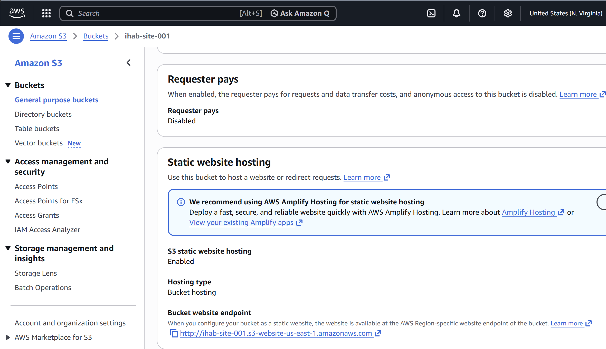

# AWS S3 Static Website Hosting

## Project Overview
This project demonstrates how to host a static website using Amazon S3.

## Services Used
- Amazon S3
- IAM Bucket Policy
- AWS Free Tier

## Steps Implemented
1. Created an S3 bucket
2. Uploaded index.html file
3. Enabled static website hosting
4. Configured public access using Bucket Policy
5. Deployed live website

## Live Demo
http://ihab-site-001.s3-website-us-east-1.amazonaws.com

## Files
- index.html

## Skills Gained
- Cloud fundamentals
- Object storage (S3)
- Public access configuration
## Screenshots

### Live Website

### Static Website Hosting Enabled

### Bucket Objects

